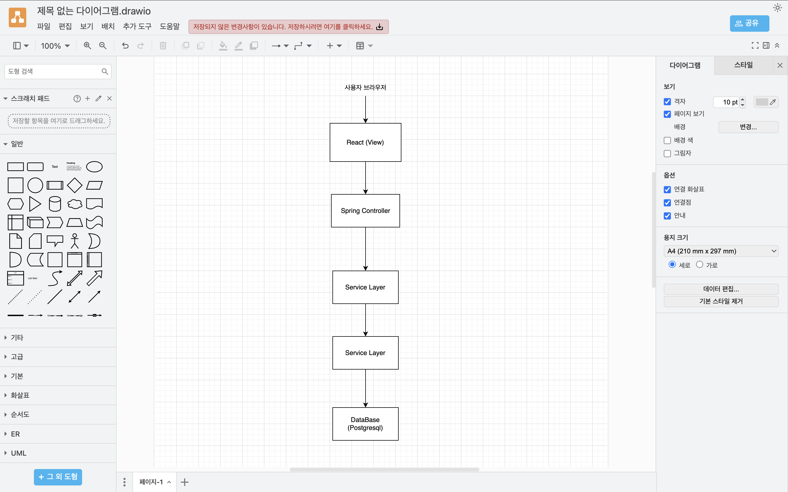

## 📘 프로젝트 소개

**Analog**는 개인 블로그 플랫폼으로, 게시글 작성, 댓글, 실시간 채팅 및 키워드 검색 기능을 제공합니다.  
프론트엔드는 React, 백엔드는 Spring Boot 기반의 Monolithic 구조로 개발되었습니다.


## 기술스택
- frontend: React, Vite , TypeSciprt
- Backend: Spring Boot, Java 20, Spring Mvc
- DB: PostgreSql
- Build: Maven
- Deployment: Docker-Compose이


## 실행방법

### 프런트엔드 실행
```
 cd client 
 yarn install 
 yarn dev
```

### 백엔드 실행
```
./mvnw clean install
./mvnw spring-boot:run
```
### ✨ 주요 기능
✅ 블로그 게시글 CRUD

- 게시글 작성, 수정, 삭제, 조회

💬 댓글 기능 (CRUD 포함)

- 게시글에 대한 댓글 등록 및 관리

💬 실시간 채팅 기능

- WebSocket을 이용한 사용자 간 채팅

🔍 검색 기능

 - 제목 또는 콘텐츠에 포함된 키워드 기반 블로그 검색


## 향후 계획 (선택 사항)
  -  markdown
### 🔮 향후 개발 예정

- 사용자 프로필 및 마이페이지 기능
- 다크모드 지원
- 알림 기능 추가

### api 명세서(swagger UI)
http://localhost:8080/swagger-ui/index.html#/

### 개발 담당
- 깃허브:https://github.com/BlogHannip/Board-server.git


